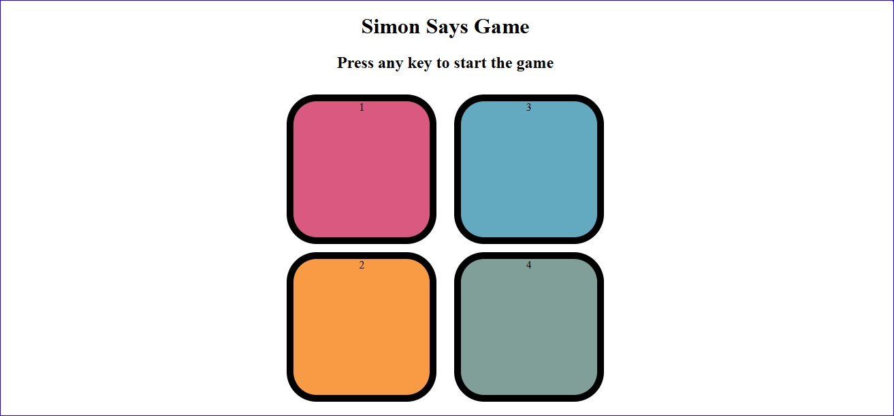

# Simon Game
## Introduction
The Simon Game is a classic memory game where players repeat a sequence of button presses in the same order. This project is a web-based implementation of the Simon Game using HTML, CSS, and JavaScript.

## Deployment

The game has been deployed using GitHub Pages and is available to experience at [SimonGame](https://schat55.github.io/simon-game/)
Please provide your valuable feedback or suggestions on the same.

## Screenshots




## Features

- Interactive gameplay.
- Increasing difficulty levels as the game progresses.
- Responsive design for a seamless experience on desktop and mobile devices.


## Technologies Used
#### HTML5
#### CSS3
#### JavaScript


## How to Play ?

- Press any key to begin the game.
- Watch the sequence of button lights.
- Repeat the sequence by clicking the buttons in the correct order.
- If you make a mistake, the game gets over and the screen flashes red.
- The game gets progressively harder as you continue.
## Contributing

#### Contributions are welcome! Here's how you can contribute:

- Fork the repository
- Create a new branch ```git checkout -b``` feature
- Make changes and commit them ```git commit -am 'Add new feature'```
- Push to the branch ```git push origin``` feature
- Create a new Pull Request

